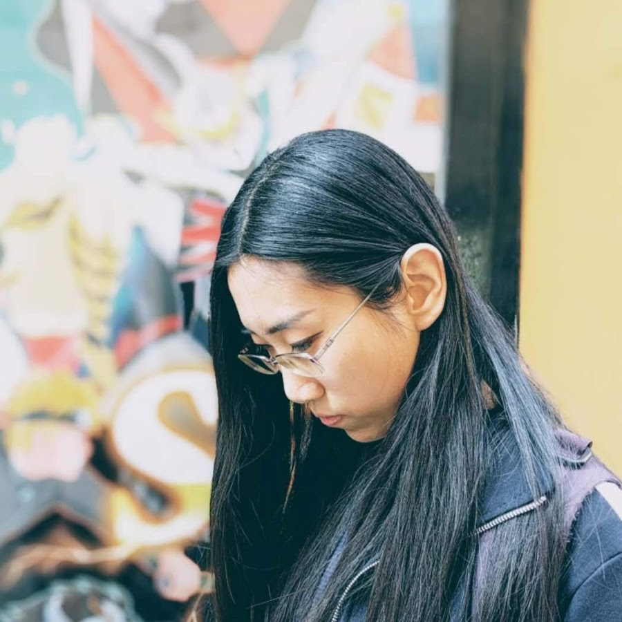
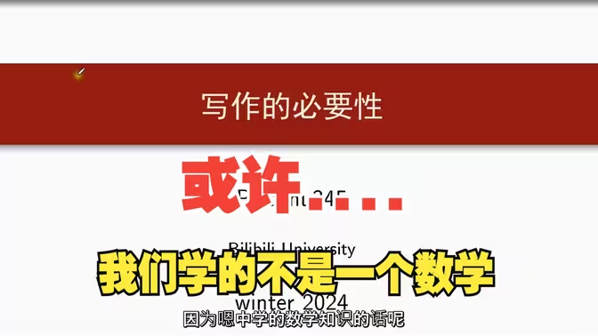
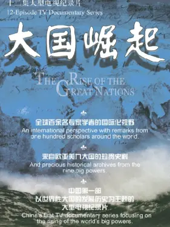

# video

- [youtube](#youtube)
	- [youtube-video](#youtube-video)
	- [youtube-channel](#youtube-channel)
- [bilibili](#bilibili)
	- [bilibili-video](#bilibili-video)
	- [bilibili-bangumi](#bilibili-bangumi)
	- [bilibili-user](#bilibili-user)

## youtube

### youtube-video

- [銷售超過8萬份的酪梨純愛遊戲 ?\! 這款作品為什麼這麼強 ? 【酪梨好好吃】 \- YouTube](<https://www.youtube.com/watch?v=89ZUjfKw-88>) | [note](<youtube/youtube-video/youtube-video-89ZUjfKw-88.md>)
- [這款網遊九成以上角色都是酪梨 \! 這款遊戲真的沒問題嗎? \- YouTube](<https://www.youtube.com/watch?v=qM-8TtSMS04>) | [note](<youtube/youtube-video/youtube-video-qM-8TtSMS04.md>)
- [【枫说】洗脑程度测试：盘点中共打进人们脑海中的十个思想钢印。连马斯克都中招了 \- YouTube](<https://www.youtube.com/watch?v=m0WEYBL538I>) | [note](<youtube/youtube-video/youtube-video-m0WEYBL538I.md>)
- [马斯克等大佬是怎么记住这么多知识的？【考试脑科学】 \- YouTube](<https://www.youtube.com/watch?v=VSe7Uhi4jTQ>) | [note](<youtube/youtube-video/youtube-video-VSe7Uhi4jTQ.md>)
- [I'm 57\. If you're in your 20's please watch this\. \- YouTube](<https://www.youtube.com/watch?v=FylHa4_neOA>) | [note](<youtube/youtube-video/youtube-video-FylHa4_neOA.md>)

#### [銷售超過8萬份的酪梨純愛遊戲 ?\! 這款作品為什麼這麼強 ? 【酪梨好好吃】 \- YouTube](<https://www.youtube.com/watch?v=89ZUjfKw-88>) | [note](<youtube/youtube-video/youtube-video-89ZUjfKw-88.md>)

遊戲名稱 : 幸福家里蹲的養成方法 遊戲購買 : DLsite 🔔小宇的各種社群網站‣‣https://linktr.ee/holyloliempire 🔔免費領取DLsite優惠券‣‣https://reurl.cc/zpovk6 🔔神聖蘿碼帝國DC群‣‣ https://discord.gg/SWWWK9b...

#美少女游戏, #萝莉, #黄油, #游戏分享, #幸福家里蹲的養成方法

Created at: 2026-02-04T00:26:27+08:00

> 遊戲名稱 : 幸福家里蹲的養成方法

|  |  |
| --- | --- |
| up | [collection\-youtube\-video](<docs/collection/collection-youtube-video.md>) |
| authors | [神聖蘿碼帝國\-小宇🔞 \- YouTube](<youtube/youtube-channel/youtube-channel-UCXlXvZRqoiSFso7hfoAnw3Q.md>) |
| aliases | 銷售超過8萬份的酪梨純愛遊戲 ?\! 這款作品為什麼這麼強 ? 【酪梨好好吃】 \- YouTube |
| mtime | 2026-02-04T00:26:27+08:00 |
| note-cover-raw | [https://i\.ytimg\.com/vi/89ZUjfKw\-88/maxresdefault\.jpg](<https://i.ytimg.com/vi/89ZUjfKw-88/maxresdefault.jpg>) |

#### [這款網遊九成以上角色都是酪梨 \! 這款遊戲真的沒問題嗎? \- YouTube](<https://www.youtube.com/watch?v=qM-8TtSMS04>) | [note](<youtube/youtube-video/youtube-video-qM-8TtSMS04.md>)

遊戲名稱 : りりぃあんじぇ遊戲平台 : FANZA GAMES🔔小宇的各種社群網站‣‣https://linktr.ee/holyloliempire 🔔免費領取DLsite優惠券‣‣https://reurl.cc/zpovk6 🔔神聖蘿碼帝國DC群‣‣  https://discord.gg/SWWWK9b...

#美少女游戏, #萝莉, #黄油, #游戏分享, #りりぃあんじぇ

Created at: 2026-02-02T02:03:32+08:00

> 遊戲名稱 : りりぃあんじぇ

|  |  |
| --- | --- |
| up | [collection\-youtube\-video](<docs/collection/collection-youtube-video.md>) |
| authors | [神聖蘿碼帝國\-小宇🔞 \- YouTube](<youtube/youtube-channel/youtube-channel-UCXlXvZRqoiSFso7hfoAnw3Q.md>) |
| aliases | 這款網遊九成以上角色都是酪梨 \! 這款遊戲真的沒問題嗎? \- YouTube |
| mtime | 2026-02-02T02:03:32+08:00 |
| note-cover-raw | [https://i\.ytimg\.com/vi/qM\-8TtSMS04/maxresdefault\.jpg](<https://i.ytimg.com/vi/qM-8TtSMS04/maxresdefault.jpg>) |

#### [【枫说】洗脑程度测试：盘点中共打进人们脑海中的十个思想钢印。连马斯克都中招了 \- YouTube](<https://www.youtube.com/watch?v=m0WEYBL538I>) | [note](<youtube/youtube-video/youtube-video-m0WEYBL538I.md>)

请大家帮忙订阅、点赞、评论，谢谢！成为此频道的会员即可获享以下福利：https://www.youtube.com/channel/UCgdGtFg63SjhXXDLJveCCcg/join备用平台：https://www.patreon.com/dkctyb3344防失联Twitter：https://x.co...

#政治, #宣传, #列表

Created at: 2025-01-11T19:26:32+08:00

> 前提假设：
> 1. 凡是革命都是正义的。
> 2. 中共的执政是历史和人民的选择。
> 3. 党永远伟大、光荣、正确。
> 4. 政党=国家=人民
> 5. 国家和集体利益高于一切，爱国是第一价值观。
> 6. 大一统好过各自为政。
> 7. 对美日为首的西方国家的敌意。
> 8. 中国国情特殊，不适合西方思想、制度。
> 9. 中华民族是个热爱和平的民族，中国从来没有侵略过其他国家。
> 10. 国家都应该主权独立，领土完整，不被外国干涉内政。

|  |  |
| --- | --- |
| up | [collection\-youtube\-video](<docs/collection/collection-youtube-video.md>) |
| aliases | 【枫说】洗脑程度测试：盘点中共打进人们脑海中的十个思想钢印。连马斯克都中招了 \- YouTube |
| mtime | 2025-11-09T22:24:12+08:00 |

#### [马斯克等大佬是怎么记住这么多知识的？【考试脑科学】 \- YouTube](<https://www.youtube.com/watch?v=VSe7Uhi4jTQ>) | [note](<youtube/youtube-video/youtube-video-VSe7Uhi4jTQ.md>)

如果学习方法存在问题，即使身边有再多的知识，对我们来说也不过是无意义的信息而已。如果你对汲取知识有着同样的疑惑，那本期视频，我们将一起去探索人类的大脑，学习如何记住自己读过的书！📮我的日常思考与灵感：https://theharry.notion.site🎬章节：00:00 引入01:20 长期记忆与短期记忆...

#学习方法

Created at: 2024-11-28T16:12:44+08:00

> Nov 27, 2024
> 
> 如果学习方法存在问题，即使身边有再多的知识，对我们来说也不过是无意义的信息而已。
> 
> 如果你对汲取知识有着同样的疑惑，那本期视频，我们将一起去探索人类的大脑，学习如何记住自己读过的书！
> 
> 📮我的日常思考与灵感：[https://theharry.notion.site](https://www.youtube.com/redirect?event=video_description&redir_token=QUFFLUhqblRtWFNMaDJKaXRmTmg5YXh2NGkzZDhsdGJxQXxBQ3Jtc0tsQ1QtOFJPclIyRWFIX1VWZktHcjRKWUphRzNkSkdyakJicGpqcmtCVGpucEpuTlRiVmk5MnZWcENOd1FnZEk4UHg2U3RUZG1wOS0yQ0V1blFORmNxcHhRQ01sd0xDcnJVU3ZXMnFwbl9rWlFZblc2MA&q=https%3A%2F%2Ftheharry.notion.site%2F&v=VSe7Uhi4jTQ)
> 
> 🎬章节： 
> - [00:00](https://www.youtube.com/watch?v=VSe7Uhi4jTQ&t=0s) 引入
> - [01:20](https://www.youtube.com/watch?v=VSe7Uhi4jTQ&t=80s) 长期记忆与短期记忆 
> - [06:18](https://www.youtube.com/watch?v=VSe7Uhi4jTQ&t=378s) “欺骗”大脑的方法 （科学记忆的方法）
> 	- 重复
> 	- 组块化记忆
> 	- 警惕记忆干扰（分散化学习和复习，重心放在学习上）
> 	- 1 个月内复习（及时复习，按时复习（复习计划））
> 	- 保持原状
> 	- 重视输出
> - [14:16](https://www.youtube.com/watch?v=VSe7Uhi4jTQ&t=856s) 海马体和 LTP 
> 	- 运用好奇心（提高 80、90% 记忆效率）
> 	- 唤醒杏仁核，调用情绪（杏仁核刺激旁边的海马体）
> 	- 狮子记法（适当饥饿，适当寒冷）
> - [19:49](https://www.youtube.com/watch?v=VSe7Uhi4jTQ&t=1189s) 睡眠 （过程中会自动整理信息（在停止输入信息时））
> - [22:58](https://www.youtube.com/watch?v=VSe7Uhi4jTQ&t=1378s) 模糊的大脑 （模型泛化）(迁移学习)
> - [29:04](https://www.youtube.com/watch?v=VSe7Uhi4jTQ&t=1744s) 尾声 （长期主义）
> 

|  |  |
| --- | --- |
| up | [collection\-youtube\-video](<docs/collection/collection-youtube-video.md>) |
| aliases | 马斯克等大佬是怎么记住这么多知识的？【考试脑科学】 \- YouTube |
| mtime | 2025-11-09T22:24:12+08:00 |

#### [I'm 57\. If you're in your 20's please watch this\. \- YouTube](<https://www.youtube.com/watch?v=FylHa4_neOA>) | [note](<youtube/youtube-video/youtube-video-FylHa4_neOA.md>)

Get a FREE AI-built Shopify store in less than 2 minutes:https://www.buildyourstore.ai/mark-tilburyUse the promo code TILBURY to get a free share worth up to...

#经验分享

Created at: 2024-11-22T21:32:53+08:00

> 2,558,057 views  Sep 28, 2024
> Get a FREE AI-built Shopify store in less than 2 minutes:
> https://www.buildyourstore.ai/mark-ti...
> 
> Use the promo code TILBURY to get a free share worth up to £100 or visit https://www.trading212.com/join/TILBURY (terms & conditions apply)
> 
> If I were to give advice to my 20 year old self, this is what I'd say to him.
> 
> Thanks ‪@danfounder‬ for inspiring this video!
> 
> ________________________________________________
> 
> TIME STAMPS:
> - 00:00 Intro
> - 00:09 1. Work on your willpower
> - 00:40 2. Producer VS Consumer
> - 00:54 3. Be nice to people on the come up
> - 01:19 4. Watch others & then do the opposite
> - 01:59 5. Who you know matters more than what you know
> - 02:10 6. Never talk behind someone's back
> - 02:28 7. Make more mistakes
> - 02:59 8. Make reversible decisions quickly
> - 03:22 9. Focus on one thing at a time
> - 03:36 10. Don’t be the best, be the only
> - 04:00 11. If you don’t like something then change it.
> - 04:31 12. Work smart not hard
> - 05:52 13: Assume you can learn something new from everyone
> - 06:22 14. Never disrespect your elders
> - 06:44 15. Don’t be scared of change, embrace it.
> - 07:18 16. Live in the moment, not on your phone
> - 07:46 17. Always pay the bill
> - 08:02 18. Say no if you aren’t ready
> - 08:20 19. Present yourself in the way you wish to be perceived
> - 08:41 20. Mentally prepare yourself for your loved ones dying
> - 09:04 21. Never take rejection personally
> - 09:18 22. Don’t be embarrassed to take a nap
> - 09:40 23. Learn from those who disagree with you
> - 09:56 24. Never be late
> - 10:10 25. Be motivated by something greater than money
> - 10:38 26. Be fuelled by vision not fear
> - 10:48 27. Stand up to bullies
> - 11:13 28. Use your unfair advantages
> - 11:39 29. Skip the flashy car
> - 12:00 30. Prioritise your reputation
> - 12:17 31. Don't compare yourself to your friends
> - 12:36 32. Don’t let a bad day turn into a bad week
> - 12:55 33. Always Pay off your credit card
> - 13:12 34. Any job is better than no job
> - 13:36 35. Never invest without doing your research
> - 13:56 36. Being a great storyteller can get you anything you want
> - 14:21 37. Don’t live your life for others
> - 14:42 38. Have a solid paycheck routine
> - 15:21 39. It's not the end of the world if you don't have everything figured out
> - 15:52 40. Start investing now
> - 16:14 41. The quality of your questions will shape your future success.
> - 16:56 42. Make sure to enjoy the journey, not just focus on the destination
> - 17:39 43. Nothing is ever free
> - 18:20 44. Stop waiting to be inspired
> - 18:44 45. Work hard now for an easier life later
> - 19:33 46. Tackle the tough tasks in the morning
> - 20:15 47. The name of a university means absolutely nothing
> - 20:35 48. Look after your back.
> - 21:14 49. Don’t stress about being different—you don’t have to fit in
> - 21:58 50. Choose your partner wisely.
> 
> ________________________________________________
> 
> GET IN TOUCH:
> - For business inquires only, please use this email: mark@marktilbury.com
> 
>  Some of the links in this description are affiliate links that I get a commission from
> 
> 

|  |  |
| --- | --- |
| up | [collection\-youtube\-video](<docs/collection/collection-youtube-video.md>) |
| authors | [Mark Tilbury \- YouTube](<youtube/youtube-channel/youtube-channel-UCxgAuX3XZROujMmGphN_scA.md>) |
| aliases | I'm 57\. If you're in your 20's please watch this\. \- YouTube |
| mtime | 2025-11-09T22:24:12+08:00 |

### youtube-channel

- [Mark Tilbury \- YouTube](<https://www.youtube.com/channel/UCxgAuX3XZROujMmGphN_scA>) | [note](<youtube/youtube-channel/youtube-channel-UCxgAuX3XZROujMmGphN_scA.md>)
- [神聖蘿碼帝國\-小宇🔞 \- YouTube](<https://www.youtube.com/channel/UCXlXvZRqoiSFso7hfoAnw3Q>) | [note](<youtube/youtube-channel/youtube-channel-UCXlXvZRqoiSFso7hfoAnw3Q.md>)
- [多伦多方脸 \- YouTube](<https://www.youtube.com/channel/UCzYYzigb1vXR0GQXXBja2kg>) | [note](<youtube/youtube-channel/youtube-channel-UCzYYzigb1vXR0GQXXBja2kg.md>)
- [安争鸣（Stella An） \- YouTube](<https://www.youtube.com/channel/UCBNpk9A7simOnmlcJPkxg5w>) | [note](<youtube/youtube-channel/youtube-channel-UCBNpk9A7simOnmlcJPkxg5w.md>)

#### [Mark Tilbury \- YouTube](<https://www.youtube.com/channel/UCxgAuX3XZROujMmGphN_scA>) | [note](<youtube/youtube-channel/youtube-channel-UCxgAuX3XZROujMmGphN_scA.md>)

I firmly believe that anyone who learns the skill sets of a millionaire can become a millionaire, ANYONE...

#经验分享

Created at: 2026-02-04T00:54:50+08:00

> No comment

|  |  |
| --- | --- |
| up | [collection\-youtube\-channel](<docs/collection/collection-youtube-channel.md>) |
| works | [I'm 57\. If you're in your 20's please watch this\. \- YouTube](<youtube/youtube-video/youtube-video-FylHa4_neOA.md>) |
| aliases | Mark Tilbury \- YouTube |
| mtime | 2026-02-04T00:54:50+08:00 |

#### [神聖蘿碼帝國\-小宇🔞 \- YouTube](<https://www.youtube.com/channel/UCXlXvZRqoiSFso7hfoAnw3Q>) | [note](<youtube/youtube-channel/youtube-channel-UCXlXvZRqoiSFso7hfoAnw3Q.md>)

哈囉 大家好 我是小宇 歡迎來到我的頻道神聖蘿碼帝國~  每周都會有黃油介紹的影片 可以加入我的DC群組成為蘿碼帝國的國民!  廠商有任何工商需求都可以透過信箱聯絡我~ Gamil : holyloliempire@gmail.com

#游戏分享, #萝莉, #黄油

Created at: 2026-02-02T02:09:25+08:00

> No comment

|  |  |
| --- | --- |
| up | [collection\-youtube\-channel](<docs/collection/collection-youtube-channel.md>) |
| works | [這款網遊九成以上角色都是酪梨 \! 這款遊戲真的沒問題嗎? \- YouTube](<youtube/youtube-video/youtube-video-qM-8TtSMS04.md>) [銷售超過8萬份的酪梨純愛遊戲 ?\! 這款作品為什麼這麼強 ? 【酪梨好好吃】 \- YouTube](<youtube/youtube-video/youtube-video-89ZUjfKw-88.md>) |
| aliases | 神聖蘿碼帝國\-小宇🔞 \- YouTube |
| mtime | 2026-02-02T02:09:25+08:00 |
| note-icon-raw | [https://yt3\.googleusercontent\.com/Fj\_Rc\_FCNT5jDS\_lQFojxKdCeO7oA\-QhYYtCRoLHBl5dGn\-0osP5nopB6ww3cQrcliG5TwdsBA=s900\-c\-k\-c0x00ffffff\-no\-rj](<https://yt3.googleusercontent.com/Fj_Rc_FCNT5jDS_lQFojxKdCeO7oA-QhYYtCRoLHBl5dGn-0osP5nopB6ww3cQrcliG5TwdsBA=s900-c-k-c0x00ffffff-no-rj>) |

#### [多伦多方脸 \- YouTube](<https://www.youtube.com/channel/UCzYYzigb1vXR0GQXXBja2kg>) | [note](<youtube/youtube-channel/youtube-channel-UCzYYzigb1vXR0GQXXBja2kg.md>)

多谢你对我的支持。推特：多伦多方脸 @torontobigface商务联系邮箱：Torontosquareface@gmail.com

#政治, #时事, #反共

Created at: 2025-02-04T16:33:54+08:00

> No comment

|  |  |
| --- | --- |
| up | [collection\-youtube\-channel](<docs/collection/collection-youtube-channel.md>) |
| aliases | 多伦多方脸 \- YouTube |
| mtime | 2025-11-09T22:22:26+08:00 |

#### [安争鸣（Stella An） \- YouTube](<https://www.youtube.com/channel/UCBNpk9A7simOnmlcJPkxg5w>) | [note](<youtube/youtube-channel/youtube-channel-UCBNpk9A7simOnmlcJPkxg5w.md>)

阅读丰富人生(●'◡'●)欢迎来到我的频道！这里有许多蛮有趣的书，还有一个蛮有趣的人。推特：@starlightcaesar副频道：小鸣说 @xiaomingtalk

#读书分享, #政治, #文学

Created at: 2024-11-28T16:57:07+08:00

> No comment

|  |  |
| --- | --- |
| up | [collection\-youtube\-channel](<docs/collection/collection-youtube-channel.md>) |
| aliases | 安争鸣（Stella An） \- YouTube |
| mtime | 2025-11-14T10:13:34+08:00 |
| note-icon-raw | [https://yt3\.googleusercontent\.com/ytc/AIdro\_nw5gJY\-h0Q7TBZg8UPsBNLmyI\-eM7ICSIwhJNOCR1Yxzg=s900\-c\-k\-c0x00ffffff\-no\-rj](<https://yt3.googleusercontent.com/ytc/AIdro_nw5gJY-h0Q7TBZg8UPsBNLmyI-eM7ICSIwhJNOCR1Yxzg=s900-c-k-c0x00ffffff-no-rj>) |

## bilibili

### bilibili-video

- [2026最新分享，如何做好文献阅读及笔记整理，同济大学博士手把手教你阅读文献\_哔哩哔哩\_bilibili](<https://www.bilibili.com/video/BV1L3zFBWEFV>) | [note](<bilibili/bilibili-video/bilibili-video-BV1L3zFBWEFV.md>)
- [西蒙学习法：六个月成为任何领域专家的科学公式。为什么有人学一次记一辈子？诺奖得主发现了大脑存储的秘密。\_哔哩哔哩\_bilibili](<https://www.bilibili.com/video/BV1W9zyBaEf2/>) | [note](<bilibili/bilibili-video/bilibili-video-BV1W9zyBaEf2.md>)
- [博学方法：如何掌握任何技能！\_哔哩哔哩\_bilibili](<https://www.bilibili.com/video/BV1DsgEz5E9s>) | [note](<bilibili/bilibili-video/bilibili-video-BV1DsgEz5E9s.md>)
- [【彩色修复】1933年希特勒总理就职演讲完整版，令人不寒而栗\_哔哩哔哩\_bilibili](<https://www.bilibili.com/video/BV1V5p4zMEHW>) | [note](<bilibili/bilibili-video/bilibili-video-BV1V5p4zMEHW.md>)
- [40年前那个令人窒息的红色帝国\_哔哩哔哩\_bilibili](<https://www.bilibili.com/video/BV1r5411W7JG>) | [note](<bilibili/bilibili-video/bilibili-video-BV1r5411W7JG.md>)
- [乡间的暑假生活，这光把男主介绍给全村人就十几分钟，我的天。。。。。。\_单机游戏热门视频\_哔哩哔哩\_bilibili](<https://www.bilibili.com/video/BV1Fv411N7Rq>) | [note](<bilibili/bilibili-video/bilibili-video-BV1Fv411N7Rq.md>)
- [伊吹：当天的错误就要当天教育哦\_哔哩哔哩\_bilibili](<https://www.bilibili.com/video/BV1JSr7YZE1V>) | [note](<bilibili/bilibili-video/bilibili-video-BV1JSr7YZE1V.md>)
- [真可爱捏~\_哔哩哔哩\_bilibili](<https://www.bilibili.com/video/BV1u3411a7qy>) | [note](<bilibili/bilibili-video/bilibili-video-BV1u3411a7qy.md>)
- [【数学杂谈】硬核模式学数学？你欧拉转世吗？\_哔哩哔哩\_bilibili](<https://www.bilibili.com/video/BV1X1BCY1EHp>) | [note](<bilibili/bilibili-video/bilibili-video-BV1X1BCY1EHp.md>)

#### [2026最新分享，如何做好文献阅读及笔记整理，同济大学博士手把手教你阅读文献\_哔哩哔哩\_bilibili](<https://www.bilibili.com/video/BV1L3zFBWEFV>) | [note](<bilibili/bilibili-video/bilibili-video-BV1L3zFBWEFV.md>)

视频播放量 1269、弹幕量 2、点赞数 71、投硬币枚数 23、收藏人数 289、转发人数 17, 视频作者 道一又道, 作者简介 1V1论文辅导发表，毕业论文，中/英文会议普刊、中文核心、SCI、数模转学术论文等，S信咨询 关注gzh 【睿森科研】，

[\#G](<clc/clc-g.md>), #2026最新分享，如何做好文献阅读及笔记整理，同济大学博士手把手教你阅读文献, #课程, #大学, #同济大学, #学习, #博士, #经验分享, #干货分享, #学习心得, #文献阅读, #科研论文, #知识, #哔哩哔哩, #bilibili, #B站, #弹幕

Created at: 2026-02-03T04:10:07+08:00

> 1. 为什么要做文献阅读
> 2. 如何做好文献阅读
> 3. 如何做好笔记整理

|  |  |
| --- | --- |
| up | [collection\-bilibili\-video](<docs/collection/collection-bilibili-video.md>) |
| authors | [道一又道\-bilibili\-哔哩哔哩](<bilibili/bilibili-user/bilibili-user-3546706654268153.md>) |
| aliases | 2026最新分享，如何做好文献阅读及笔记整理，同济大学博士手把手教你阅读文献\_哔哩哔哩\_bilibili |
| mtime | 2026-02-03T04:10:07+08:00 |
| published | 2026-01-22T19:12:04+08:00 |
| uploaded | 2026-01-24T19:00:00+08:00 |

#### [西蒙学习法：六个月成为任何领域专家的科学公式。为什么有人学一次记一辈子？诺奖得主发现了大脑存储的秘密。\_哔哩哔哩\_bilibili](<https://www.bilibili.com/video/BV1W9zyBaEf2/>) | [note](<bilibili/bilibili-video/bilibili-video-BV1W9zyBaEf2.md>)

本视频深度拆解西蒙学习法的底层逻辑，包括大脑组块化存储机制、有效学习时间的计算公式、以及可直接复制的"三三制"操作方法。无论你想学编程、投资、写作还是任何新技能，这套被马斯克、费曼等顶级人才验证过的方法论，都能帮你在最短时间内完成认知升级。

[\#G](<clc/clc-g.md>), #费曼学习法, #刻意学习, #内化学习, #计划学习, #三三制学习, #渐进式总结笔记法, #年度宝藏知识, #西蒙学习法, #学习方法, #认知觉醒, #涨知识, #个人成长, #自我提升, #高效学习, #思维升级, #刻意练习

Created at: 2026-01-26T14:08:00+08:00

> 1. 论学习时间长度——西蒙学习法：用六个月可以从0到专家，并且每天一万小时定理不准确
> 2. 费曼学习法好——斯坦福记忆实验：多看几遍不如逼自己输出一遍，比如做笔记、写作和教学
> 3. 刻意学习好——高强度专注学习较长时间，从而提高有效学习的成果
> 4. 内化学习好——注重对知识的理解，在大脑中构建知识的图谱或数据库
> 5. 计划学习好——a. 将大的学习目标归约成小的学习目标；b. 构建多个学习项目的有向无环图，从而表示知识点和学习项目的先后关系；c. 执行三三制学习
> 6. 三三制学习好——用三个 30 分钟执行三个步骤： a. 输入新知识：读书和主动做笔记；b. 闭卷自我考试：在合上书时，复述学过的所有知识点，查漏补缺直到完全记住；c. 应用自己学到的知识：做题或运用自己的知识到一个案例或场景
> 7. 渐进式总结笔记法好——总结每周、每月、每年学习的知识到特定的一个文章

|  |  |
| --- | --- |
| up | [collection\-bilibili\-video](<docs/collection/collection-bilibili-video.md>) |
| authors | [认知刺客\-bilibili\-哔哩哔哩](<bilibili/bilibili-user/bilibili-user-3546966132787579.md>) |
| aliases | 西蒙学习法：六个月成为任何领域专家的科学公式。为什么有人学一次记一辈子？诺奖得主发现了大脑存储的秘密。\_哔哩哔哩\_bilibili |
| mtime | 2026-01-26T14:08:00+08:00 |
| note-cover-raw | [bilibili/bilibili\-video/bilibili\-video\-BV1W9zyBaEf2\.jpg](<bilibili/bilibili-video/bilibili-video-BV1W9zyBaEf2.jpg>)  |

#### [博学方法：如何掌握任何技能！\_哔哩哔哩\_bilibili](<https://www.bilibili.com/video/BV1DsgEz5E9s>) | [note](<bilibili/bilibili-video/bilibili-video-BV1DsgEz5E9s.md>)

No description

[\#G](<clc/clc-g.md>)

Created at: 2026-01-21T21:30:00+08:00

> 1. 学习是一个系统; 
> Learning is system; 
> 2. 最重要的原则：贪得无厌的好奇心; 
> The most important principle: insatiable curiosity; 
> 3. 基本的原则：知识分子的谦逊，即认识到自己的无知; 
> The fundamental principle: intellectual humility, that is, recognizing one's own ignorance. 
> 4. 要点：理解失败是成功之母; 
> Key point: understand that failure is the mother of success; 
> 5. 另一个要点：注意身心健康和日常生活：吃好，睡好，运动好，生活专心; 
> Another key point: Pay attention to your physical and mental health and daily life: eat well, sleep well, exercise regularly, and live mindfully;
> 6. 积极主动学习，抓住一切机会进行学习; 
> Be proactive in learning and seize every opportunity to learn;
> 7. 主动练习，学以致用;
> Actively practice and apply what you learn;
> 8. 主动复习，回忆和总结;
> Actively review, recall, and summarize;
> 9. 制定可行的，长期的学习计划，并执行;
> Develop and execute a feasible, long-term learning plan;
> 10. 指定固定的时间学习（时间块法）;
> Allocate fixed time slots for studying (time blocking);
> 11. 拒绝拖延症，从小处入手;
> Avoid procrastination by starting with small steps;
> 12. 连接不同的知识，抓住本质联系，从而促进创新
> Connect different pieces of knowledge, grasp the essential connections, and thus foster innovation;
> 13. 使用 ZK 卡片盒笔记法来积累和连接想法，从而创造一个结构化的知识网络
> Use the Zettelkasten method to accumulate and connect ideas, creating a structured knowledge network;
> 14. 使用隐喻和类比来使复杂的事物更容易理解
> Use metaphors and analogies to make complex things easier to understand;
> 15. 同时学习和研究多个领域的知识，并抓住事物间的本质联系
> Learn and research knowledge from multiple fields simultaneously, and grasp the essential connections between things;
> 16. 去创造新的事物，比如写作，编程和创作
> Create new things, such as writing, programming, and creative works;
> 17. 使用结构化的教学平台
> Use structured learning platforms;
> 18. 使学习游戏化
> Gamify learning;
> 19. 打造免打扰的数字环境，从而保持专心和避免分心
> Create a distraction-free digital environment to maintain focus and avoid distractions;
> 20. 使用科技记录和分享自己的学习，比如写博客，创建 YouTube 频道和在社交媒体上发布摘要（费曼学习法）
> Use technology to record and share your learning, such as writing a blog, creating a YouTube channel, and posting summaries on social media (Feynman technique).

|  |  |
| --- | --- |
| up | [collection\-bilibili\-video](<docs/collection/collection-bilibili-video.md>) |
| authors | [YouTube精选速递\-bilibili\-哔哩哔哩](<bilibili/bilibili-user/bilibili-user-36141489.md>) |
| aliases | 博学方法：如何掌握任何技能！\_哔哩哔哩\_bilibili |
| mtime | 2026-01-21T21:30:00+08:00 |
| note-cover-raw | [bilibili/bilibili\-video/bilibili\-video\-BV1DsgEz5E9s\.jpg](<bilibili/bilibili-video/bilibili-video-BV1DsgEz5E9s.jpg>)  |

#### [【彩色修复】1933年希特勒总理就职演讲完整版，令人不寒而栗\_哔哩哔哩\_bilibili](<https://www.bilibili.com/video/BV1V5p4zMEHW>) | [note](<bilibili/bilibili-video/bilibili-video-BV1V5p4zMEHW.md>)

No description

[\#K](<clc/clc-k.md>)

Created at: 2025-09-20T14:17:16+08:00

> music: 【Myself】 历史影像馆歌单 - MusicList

|  |  |
| --- | --- |
| up | [collection\-bilibili\-video](<docs/collection/collection-bilibili-video.md>) |
| authors | [历史影像馆\-bilibili\-哔哩哔哩](<bilibili/bilibili-user/bilibili-user-269115278.md>) |
| aliases | 【彩色修复】1933年希特勒总理就职演讲完整版，令人不寒而栗\_哔哩哔哩\_bilibili |
| mtime | 2025-11-14T10:15:36+08:00 |

#### [40年前那个令人窒息的红色帝国\_哔哩哔哩\_bilibili](<https://www.bilibili.com/video/BV1r5411W7JG>) | [note](<bilibili/bilibili-video/bilibili-video-BV1r5411W7JG.md>)

No description

[\#K](<clc/clc-k.md>)

Created at: 2025-09-18T16:03:18+08:00

> BGM：Dmitriy Emelianov-Fusillade(Part I)

|  |  |
| --- | --- |
| up | [collection\-bilibili\-video](<docs/collection/collection-bilibili-video.md>) |
| authors | [茄子蒜泥儿\-bilibili\-哔哩哔哩](<bilibili/bilibili-user/bilibili-user-98695167.md>) |
| aliases | 40年前那个令人窒息的红色帝国\_哔哩哔哩\_bilibili |
| mtime | 2025-11-14T10:15:36+08:00 |

#### [乡间的暑假生活，这光把男主介绍给全村人就十几分钟，我的天。。。。。。\_单机游戏热门视频\_哔哩哔哩\_bilibili](<https://www.bilibili.com/video/BV1Fv411N7Rq>) | [note](<bilibili/bilibili-video/bilibili-video-BV1Fv411N7Rq.md>)

No description

[\#J2](<clc/clc-j2.md>), #ACG

Created at: 2025-02-26T23:39:10+08:00

> 
> 
> [RPG] [精品 RPG/中文] 沉溺于炽热爱情的乡间隐居的哥哥与,充满古典韵味的病弱妹妹 体验版 官方中文版
> 
>  
> 
> 链接：https://pan.baidu.com/s/1oSQ8h5b8eTXAvqjQBhaEGQ 提取码：r043 od： https://kd72w-my.sharepoint.com/:u:/g/personal/xingchen3_91acggod_onmicrosoft_com/EXI-OvM2QZ1Ajy95cD7UkMMB8cNTOPajJQtSi42b8b7Ngg?e=6VfrKH 解压：91acg.top
> 
> 
> 

|  |  |
| --- | --- |
| up | [collection\-bilibili\-video](<docs/collection/collection-bilibili-video.md>) |
| authors | [风辰琳雪儿\-bilibili\-哔哩哔哩](<bilibili/bilibili-user/bilibili-user-104880307.md>) |
| images | [bilibili/bilibili\-video/bilibili\-video\-BV1Fv411N7Rq\-p1\.png](<bilibili/bilibili-video/bilibili-video-BV1Fv411N7Rq-p1.png>)  [bilibili/bilibili\-video/bilibili\-video\-BV1Fv411N7Rq\-p2\.jpg](<bilibili/bilibili-video/bilibili-video-BV1Fv411N7Rq-p2.jpg>)  [bilibili/bilibili\-video/bilibili\-video\-BV1Fv411N7Rq\-p3\.jpg](<bilibili/bilibili-video/bilibili-video-BV1Fv411N7Rq-p3.jpg>)  [bilibili/bilibili\-video/bilibili\-video\-BV1Fv411N7Rq\-p4\.png](<bilibili/bilibili-video/bilibili-video-BV1Fv411N7Rq-p4.png>)  |
| aliases | 乡间的暑假生活，这光把男主介绍给全村人就十几分钟，我的天。。。。。。\_单机游戏热门视频\_哔哩哔哩\_bilibili |
| mtime | 2025-10-01T11:41:38+08:00 |

#### [伊吹：当天的错误就要当天教育哦\_哔哩哔哩\_bilibili](<https://www.bilibili.com/video/BV1JSr7YZE1V>) | [note](<bilibili/bilibili-video/bilibili-video-BV1JSr7YZE1V.md>)

No description

[\#J2](<clc/clc-j2.md>), #ACG

Created at: 2025-02-25T23:25:13+08:00

> No comment

|  |  |
| --- | --- |
| up | [collection\-bilibili\-video](<docs/collection/collection-bilibili-video.md>) |
| authors | [伊吹继续生\-bilibili\-哔哩哔哩](<bilibili/bilibili-user/bilibili-user-3493079608723871.md>) |
| aliases | 伊吹：当天的错误就要当天教育哦\_哔哩哔哩\_bilibili |
| mtime | 2025-10-01T11:41:38+08:00 |

#### [真可爱捏~\_哔哩哔哩\_bilibili](<https://www.bilibili.com/video/BV1u3411a7qy>) | [note](<bilibili/bilibili-video/bilibili-video-BV1u3411a7qy.md>)

No description

[\#J2](<clc/clc-j2.md>), #ACG

Created at: 2025-02-25T12:04:34+08:00

> んぬ P 站 ID：4103937
> ふぇありぃあい P 站 ID：1055457
> わき P 站 ID：2609622

|  |  |
| --- | --- |
| up | [collection\-bilibili\-video](<docs/collection/collection-bilibili-video.md>) |
| authors | [阿尔弗雷特\-科尔托\-bilibili\-哔哩哔哩](<bilibili/bilibili-user/bilibili-user-47218557.md>) |
| images | [bilibili/bilibili\-video/bilibili\-video\-BV1u3411a7qy\-p1\.png](<bilibili/bilibili-video/bilibili-video-BV1u3411a7qy-p1.png>)  [bilibili/bilibili\-video/bilibili\-video\-BV1u3411a7qy\-p2\.png](<bilibili/bilibili-video/bilibili-video-BV1u3411a7qy-p2.png>)  [bilibili/bilibili\-video/bilibili\-video\-BV1u3411a7qy\-p3\.png](<bilibili/bilibili-video/bilibili-video-BV1u3411a7qy-p3.png>)  |
| aliases | 真可爱捏~\_哔哩哔哩\_bilibili |
| mtime | 2025-10-01T11:41:38+08:00 |

#### [【数学杂谈】硬核模式学数学？你欧拉转世吗？\_哔哩哔哩\_bilibili](<https://www.bilibili.com/video/BV1X1BCY1EHp>) | [note](<bilibili/bilibili-video/bilibili-video-BV1X1BCY1EHp.md>)

No description

[\#O1](<clc/clc-o1.md>), [\#N3](<clc/clc-n3.md>), [\#G35](<clc/clc-g35.md>), [\#TP391](<clc/clc-tp391.md>), [\#G64](<clc/clc-g64.md>)

Created at: 2025-01-28T15:26:29+08:00

> ## 视频主题：学数学最好要写笔记（论写作的必要性）
> 
> 1. 引子：由游戏 Diablo 的硬核模式引出数学写作的必要性
> 2. 为什么要写作？
> 	1. 大学数学的广度和深度比高中数学要大得多，不能一次性掌握
> 	2. 写作相当于游戏存档，可以防止因为遗忘导致从头再来
> 3. 怎么进行写作？（“把核桃泡软”的技巧（格罗腾迪克））
> 	1. 不要试图一次性理解某个困难的数学对象
> 		1. 通过写作辅助理解，内化，联想，思考
> 		2. 写作!=记录，写作!=抄书，要翻译成自己的语言来写一遍
> 	2. 不要试图一次性能看懂某个证明
> 4. 中图分类号：
> 	1. 【O1 数学】
> 	2. 【N3 自然科学研究方法】
> 	3. 【G35 情报学、情报工作】
> 	4. 【TP391 信息处理（信息加工）】
> 	5. 【G64 高等教育】

|  |  |
| --- | --- |
| up | [collection\-bilibili\-video](<docs/collection/collection-bilibili-video.md>) |
| authors | [PiKaChu345\-bilibili\-哔哩哔哩](<bilibili/bilibili-user/bilibili-user-180947374.md>) |
| aliases | 【数学杂谈】硬核模式学数学？你欧拉转世吗？\_哔哩哔哩\_bilibili |
| mtime | 2025-11-14T10:15:36+08:00 |

### bilibili-bangumi

- [创新中国\-纪录片\-bilibili\-哔哩哔哩](<https://www.bilibili.com/bangumi/media/md58712>) | [note](<bilibili/bilibili-bangumi/bilibili-bangumi-media-md58712.md>)
- [大国崛起\-纪录片\-bilibili\-哔哩哔哩](<https://www.bilibili.com/bangumi/media/md28233889>) | [note](<bilibili/bilibili-bangumi/bilibili-bangumi-media-md28233889.md>)
- [短路的大脑 第一季\-纪录片\-bilibili\-哔哩哔哩](<https://www.bilibili.com/bangumi/media/md28220437>) | [note](<bilibili/bilibili-bangumi/bilibili-bangumi-media-md28220437.md>)

#### [创新中国\-纪录片\-bilibili\-哔哩哔哩](<https://www.bilibili.com/bangumi/media/md58712>) | [note](<bilibili/bilibili-bangumi/bilibili-bangumi-media-md58712.md>)

《创新中国》是一部讲述中国最新科技成就和创新精神的纪录片。它关注最前沿的科学突破、最新潮的科技热点，聚焦信息技术、新型能源、中国制造、生命科学、航空航天与海洋探索等前沿领域，用鲜活的故事记录当下中国伟大的创新实践。

[\#K](<clc/clc-k.md>), #科技, #社会

Created at: 2025-09-14T16:34:49+08:00

> 1. 第1集：信息
> 2. 第2集：能源
> 3. 第3集：生命
> 4. 第4集：制造
> 5. 第5集：空海

|  |  |
| --- | --- |
| up | [collection\-bilibili\-bangumi](<docs/collection/collection-bilibili-bangumi.md>) |
| aliases | 创新中国\-纪录片\-bilibili\-哔哩哔哩 |
| mtime | 2025-10-01T11:41:39+08:00 |
| note-演员 | 马云 |
| note-导演 | 史岩、史慧、胡博、裔欣、孙超、吴小满、章莹、王心、孙泗淇、刘昀、何青 |
| note-编剧 | 许丁心 |
| note-出品方 | CCTV、央视 |

#### [大国崛起\-纪录片\-bilibili\-哔哩哔哩](<https://www.bilibili.com/bangumi/media/md28233889>) | [note](<bilibili/bilibili-bangumi/bilibili-bangumi-media-md28233889.md>)

本片由中央电视台委托制作，三多堂传媒承制了其中六集以及全片的音乐编辑工作。该片全面展示了葡萄牙、西班牙、 荷兰、英国、法国、德国、日本、 俄罗斯和美国等九个大国兴衰更替的故事。该片力求以历史的眼光和全球的视野，在风云四起的时代变迁中， 寻找推动 国家发展的根本力量，寻找各国在强国过程中创造的属于全人类的文明成果。该片播出后，在海内外获得强烈反响，成为改革开放以来国内外影响力最大的纪录片之一。

[\#K](<clc/clc-k.md>), #历史, #人文

Created at: 2025-07-27T20:27:51+08:00

> 【大国崛起：第1集 海洋时代】 https://www.bilibili.com/bangumi/play/ep395183 | 注：统一的民族国家  
> 【大国崛起：第2集 小国大业】 https://www.bilibili.com/bangumi/play/ep395184 | 注：股份公司，股份交易所，银行  
> 【大国崛起：第3集 走向现代】 https://www.bilibili.com/bangumi/play/ep395185 | 注：莎士比亚，王在法下，王在议会  
> 【大国崛起：第4集 工业先声】 https://www.bilibili.com/bangumi/play/ep395186 | 注：工业革命，科学革命，蒸汽机，国富论，自由市场  
> 【大国崛起：第5集 激情岁月】 https://www.bilibili.com/bangumi/play/ep395187  
> 【大国崛起：第6集 帝国春秋】 https://www.bilibili.com/bangumi/play/ep395188  
> 【大国崛起：第7集 百年维新】 https://www.bilibili.com/bangumi/play/ep395189  
> 【大国崛起：第8集 寻道图强】 https://www.bilibili.com/bangumi/play/ep395190  
> 【大国崛起：第9集 风云新途】 https://www.bilibili.com/bangumi/play/ep395191  
> 【大国崛起：第10集 新国新梦】 https://www.bilibili.com/bangumi/play/ep395192  
> 【大国崛起：第11集 危局新政】 https://www.bilibili.com/bangumi/play/ep395193  
> 【大国崛起：第12集 大道行思】 https://www.bilibili.com/bangumi/play/ep395194

|  |  |
| --- | --- |
| up | [collection\-bilibili\-bangumi](<docs/collection/collection-bilibili-bangumi.md>) |
| aliases | 大国崛起\-纪录片\-bilibili\-哔哩哔哩 |
| mtime | 2025-11-17T20:54:05+08:00 |
| note-music | [【DJ】帐号已注销 \- 纪录片《大国崛起》片头音乐](<bilibili/bilibili-related-files/bilibili-related-file-【DJ】帐号已注销 - 纪录片《大国崛起》片头音乐.md>) |
| note-导演 | 任学安 |
| note-制作人 | 任学安 |
| note-出品人 | 赵化勇 |
| note-监制 | 罗明、袁正明 |
| note-执行导演 | 周艳 |
| note-演员 | 孙占山 |

#### [短路的大脑 第一季\-纪录片\-bilibili\-哔哩哔哩](<https://www.bilibili.com/bangumi/media/md28220437>) | [note](<bilibili/bilibili-bangumi/bilibili-bangumi-media-md28220437.md>)

你对你的大脑了解吗？人的感官具有一定的欺骗性。我们将会看到一些稀奇古怪的实验。这些实验都将证明，大脑有时会犯下一些简单错误。这些反映了大脑的欺骗和虚幻的关键所在，也是解开大脑出错之谜的钥匙。

[\#R1](<clc/clc-r1.md>), #科技

Created at: 2025-02-07T22:20:18+08:00

> 【短路的大脑 第一季：第3集 SUPERSTITION迷信】 https://www.bilibili.com/bangumi/play/ep291151  
> url: https://www.bilibili.com/bangumi/play/ep291151  
> 第 2 集 - 有人在密码习惯性使用时产生突发性遗忘  
>  1. 记忆扭曲，错误记忆，记忆覆盖，记忆迷失，灾难性遗忘  
>  2. 注意性盲视 - 工作记忆容量只有 4 到 7 个  
>  3. 谎言被重复 1000 遍就成了真理

|  |  |
| --- | --- |
| up | [collection\-bilibili\-bangumi](<docs/collection/collection-bilibili-bangumi.md>) |
| aliases | 短路的大脑 第一季 \-纪录片\-bilibili\-哔哩哔哩 |
| mtime | 2025-11-19T15:13:00+08:00 |

### bilibili-user

- [道一又道\-bilibili\-哔哩哔哩](<https://space.bilibili.com/3546706654268153>) | [note](<bilibili/bilibili-user/bilibili-user-3546706654268153.md>)
- [认知刺客\-bilibili\-哔哩哔哩](<https://space.bilibili.com/3546966132787579>) | [note](<bilibili/bilibili-user/bilibili-user-3546966132787579.md>)
- [YouTube精选速递\-bilibili\-哔哩哔哩](<https://space.bilibili.com/36141489/>) | [note](<bilibili/bilibili-user/bilibili-user-36141489.md>)
- [原子能\-bilibili\-哔哩哔哩](<https://space.bilibili.com/162183>) | [note](<bilibili/bilibili-user/bilibili-user-162183.md>)
- [杨雨坤\-Yukun\-bilibili\-哔哩哔哩](<https://space.bilibili.com/339833006>) | [note](<bilibili/bilibili-user/bilibili-user-339833006.md>)
- [茄子蒜泥儿\-bilibili\-哔哩哔哩](<https://space.bilibili.com/98695167>) | [note](<bilibili/bilibili-user/bilibili-user-98695167.md>)
- [bili\_62511222486\-bilibili\-哔哩哔哩](<https://space.bilibili.com/689888414>) | [note](<bilibili/bilibili-user/bilibili-user-689888414.md>)
- [铁打的郎中\-bilibili\-哔哩哔哩](<https://space.bilibili.com/413597883>) | [note](<bilibili/bilibili-user/bilibili-user-413597883.md>)
- [Chubbyemu\-bilibili\-哔哩哔哩](<https://space.bilibili.com/297786973>) | [note](<bilibili/bilibili-user/bilibili-user-297786973.md>)
- [历史影像馆\-bilibili\-哔哩哔哩](<https://space.bilibili.com/269115278>) | [note](<bilibili/bilibili-user/bilibili-user-269115278.md>)
- [瑛之诗\-bilibili\-哔哩哔哩](<https://space.bilibili.com/143432483>) | [note](<bilibili/bilibili-user/bilibili-user-143432483.md>)
- [隅野贝\-bilibili\-哔哩哔哩](<https://space.bilibili.com/34106682>) | [note](<bilibili/bilibili-user/bilibili-user-34106682.md>)
- [PiKaChu345\-bilibili\-哔哩哔哩](<https://space.bilibili.com/180947374>) | [note](<bilibili/bilibili-user/bilibili-user-180947374.md>)
- [3Blue1Brown\-bilibili\-哔哩哔哩](<https://space.bilibili.com/88461692>) | [note](<bilibili/bilibili-user/bilibili-user-88461692.md>)
- [风辰琳雪儿\-bilibili\-哔哩哔哩](<https://space.bilibili.com/104880307>) | [note](<bilibili/bilibili-user/bilibili-user-104880307.md>)
- [伊吹继续生\-bilibili\-哔哩哔哩](<https://space.bilibili.com/3493079608723871>) | [note](<bilibili/bilibili-user/bilibili-user-3493079608723871.md>)
- [阿尔弗雷特\-科尔托\-bilibili\-哔哩哔哩](<https://space.bilibili.com/47218557>) | [note](<bilibili/bilibili-user/bilibili-user-47218557.md>)

#### [道一又道\-bilibili\-哔哩哔哩](<https://space.bilibili.com/3546706654268153>) | [note](<bilibili/bilibili-user/bilibili-user-3546706654268153.md>)

1V1论文辅导发表，毕业论文，中/英文会议普刊、中文核心、SCI、数模转学术论文等，S信咨询 关注gzh 【睿森科研】

No tags

Created at: 2026-02-03T04:10:07+08:00

> No comment

|  |  |
| --- | --- |
| up | [collection\-bilibili\-user](<docs/collection/collection-bilibili-user.md>) |
| bulletin | 1V1论文辅导发表，毕业论文，中/英文会议普刊、中文核心、SCI、数模转学术论文等，S信咨询  关注gzh 【睿森科研】 |
| works | [2026最新分享，如何做好文献阅读及笔记整理，同济大学博士手把手教你阅读文献\_哔哩哔哩\_bilibili](<bilibili/bilibili-video/bilibili-video-BV1L3zFBWEFV.md>) |
| aliases | 道一又道\-bilibili\-哔哩哔哩 |
| mtime | 2026-02-03T04:10:07+08:00 |

#### [认知刺客\-bilibili\-哔哩哔哩](<https://space.bilibili.com/3546966132787579>) | [note](<bilibili/bilibili-user/bilibili-user-3546966132787579.md>)

阳光下全是剧本，阴影里才有剧透。

No tags

Created at: 2026-01-26T14:08:00+08:00

> No comment

|  |  |
| --- | --- |
| up | [collection\-bilibili\-user](<docs/collection/collection-bilibili-user.md>) |
| works | [西蒙学习法：六个月成为任何领域专家的科学公式。为什么有人学一次记一辈子？诺奖得主发现了大脑存储的秘密。\_哔哩哔哩\_bilibili](<bilibili/bilibili-video/bilibili-video-BV1W9zyBaEf2.md>) |
| aliases | 认知刺客\-bilibili\-哔哩哔哩 |
| mtime | 2026-01-26T14:08:00+08:00 |
| note-birth-date | 
01\-01 |

#### [YouTube精选速递\-bilibili\-哔哩哔哩](<https://space.bilibili.com/36141489/>) | [note](<bilibili/bilibili-user/bilibili-user-36141489.md>)

认知提升、自我成长、思维模型、财富逻辑，成为更好的自己。

No tags

Created at: 2026-01-21T21:30:00+08:00

> No comment

|  |  |
| --- | --- |
| up | [collection\-bilibili\-user](<docs/collection/collection-bilibili-user.md>) |
| works | [博学方法：如何掌握任何技能！\_哔哩哔哩\_bilibili](<bilibili/bilibili-video/bilibili-video-BV1DsgEz5E9s.md>) |
| aliases | YouTube精选速递\-bilibili\-哔哩哔哩 |
| mtime | 2026-01-21T21:30:00+08:00 |

#### [原子能\-bilibili\-哔哩哔哩](<https://space.bilibili.com/162183>) | [note](<bilibili/bilibili-user/bilibili-user-162183.md>)

资深程序员/架构师/产品经理，喜欢分享“非常主观”的软件技术理念、编程开发思维、职场经验等。商务合作请联系：yuanzinengswhz

[\#TP](<clc/clc-tp.md>), #程序员, #架构师, #产品经理, #bilibili知名科技UP主

Created at: 2025-11-11T15:10:53+08:00

> No comment

|  |  |
| --- | --- |
| up | [collection\-bilibili\-user](<docs/collection/collection-bilibili-user.md>) |
| bulletin | 资深程序员/架构师/产品经理，喜欢分享“非常主观”的软件技术理念、编程开发思维、职场经验等。商务合作联系：yuanzinengswhz粉丝群用Discord，地址是：https://discord\.gg/T2Dy5uGWKA |
| aliases | 原子能\-bilibili\-哔哩哔哩 |
| mtime | 2025-11-14T10:15:36+08:00 |
| note-birth-date | 01\-01 |
| note-college | 清华大学 |

#### [杨雨坤\-Yukun\-bilibili\-哔哩哔哩](<https://space.bilibili.com/339833006>) | [note](<bilibili/bilibili-user/bilibili-user-339833006.md>)

CS PhD Student | 女儿4岁

[\#Q189](<clc/clc-q189.md>), #记忆

Created at: 2025-11-08T21:43:06+08:00

> No comment

|  |  |
| --- | --- |
| up | [collection\-bilibili\-user](<docs/collection/collection-bilibili-user.md>) |
| aliases | 杨雨坤\-Yukun\-bilibili\-哔哩哔哩 |
| mtime | 2025-11-14T10:15:36+08:00 |
| note-birth-date | 03\-06 |
| note-college | 西安交通大学 |

#### [茄子蒜泥儿\-bilibili\-哔哩哔哩](<https://space.bilibili.com/98695167>) | [note](<bilibili/bilibili-user/bilibili-user-98695167.md>)

分享自己喜爱的电子游戏，偶有灵感也整个小剪辑啥的，感谢各位观众朋友观看

[\#K](<clc/clc-k.md>), #军事, #历史

Created at: 2025-11-02T22:05:52+08:00

> No comment

|  |  |
| --- | --- |
| up | [collection\-bilibili\-user](<docs/collection/collection-bilibili-user.md>) |
| bulletin | 游戏交流QQ群：162378080 |
| works | [40年前那个令人窒息的红色帝国\_哔哩哔哩\_bilibili](<bilibili/bilibili-video/bilibili-video-BV1r5411W7JG.md>) |
| aliases | 茄子蒜泥儿\-bilibili\-哔哩哔哩 |
| mtime | 2025-11-11T15:19:42+08:00 |
| note-birth-date | 01\-23 |

#### [bili\_62511222486\-bilibili\-哔哩哔哩](<https://space.bilibili.com/689888414>) | [note](<bilibili/bilibili-user/bilibili-user-689888414.md>)

No description

[\#Z](<clc/clc-z.md>), #abc202306

Created at: 2025-11-02T21:38:11+08:00

> No comment

|  |  |
| --- | --- |
| up | [collection\-bilibili\-user](<docs/collection/collection-bilibili-user.md>) |
| aliases | bili\_62511222486\-bilibili\-哔哩哔哩 |
| mtime | 2025-11-14T10:15:36+08:00 |

#### [铁打的郎中\-bilibili\-哔哩哔哩](<https://space.bilibili.com/413597883>) | [note](<bilibili/bilibili-user/bilibili-user-413597883.md>)

一听就懂的眼睛科普/杭州工作室验配预约v:langzhong6069/国家十三五规划教材《眼镜学》第三版编委

[\#R1](<clc/clc-r1.md>), #预防医学, #眼科学

Created at: 2025-10-09T14:35:58+08:00

> No comment

|  |  |
| --- | --- |
| up | [collection\-bilibili\-user](<docs/collection/collection-bilibili-user.md>) |
| aliases | 铁打的郎中\-bilibili\-哔哩哔哩 |
| mtime | 2025-11-11T15:19:42+08:00 |
| note-birth-date | 10\-18 |

#### [Chubbyemu\-bilibili\-哔哩哔哩](<https://space.bilibili.com/297786973>) | [note](<bilibili/bilibili-user/bilibili-user-297786973.md>)

胖鸸鹋Chubbyemu官方频道~商务合作请联系邮箱 hello@Chubbyemu.com

[\#R1](<clc/clc-r1.md>), #预防医学, #临床医学, #内科学

Created at: 2025-10-05T01:44:29+08:00

> No comment

|  |  |
| --- | --- |
| up | [collection\-bilibili\-user](<docs/collection/collection-bilibili-user.md>) |
| bulletin | I make medical videos, telling stories in medicine\. These are variations or cases I, or my colleagues, have seen in the past\. |
| aliases | 胖鹈鹕\-bilibili\-哔哩哔哩 Chubbyemu\-bilibili\-哔哩哔哩 |
| mtime | 2025-11-11T15:19:42+08:00 |

#### [历史影像馆\-bilibili\-哔哩哔哩](<https://space.bilibili.com/269115278>) | [note](<bilibili/bilibili-user/bilibili-user-269115278.md>)

精力不足，喜欢懒觉 合作请加微信Yzz521357

[\#K](<clc/clc-k.md>), #历史, #档案, #录像, #近现代史

Created at: 2025-09-19T16:46:48+08:00

> No comment

|  |  |
| --- | --- |
| up | [collection\-bilibili\-user](<docs/collection/collection-bilibili-user.md>) |
| works | [【彩色修复】1933年希特勒总理就职演讲完整版，令人不寒而栗\_哔哩哔哩\_bilibili](<bilibili/bilibili-video/bilibili-video-BV1V5p4zMEHW.md>) |
| aliases | 历史影像馆\-bilibili\-哔哩哔哩 |
| mtime | 2025-11-11T15:19:42+08:00 |
| note-birth-date | 07\-21 |

#### [瑛之诗\-bilibili\-哔哩哔哩](<https://space.bilibili.com/143432483>) | [note](<bilibili/bilibili-user/bilibili-user-143432483.md>)

进群自取

[\#G989](<clc/clc-g989.md>), #GalGame, #分享, #QQ群

Created at: 2025-09-16T07:51:03+08:00

> No comment

|  |  |
| --- | --- |
| up | [collection\-bilibili\-user](<docs/collection/collection-bilibili-user.md>) |
| aliases | 瑛之诗\-bilibili\-哔哩哔哩 |
| mtime | 2025-11-11T15:19:42+08:00 |
| note-qq-group | [藤田琴音游戏交流群（bili瑛之诗）](<bilibili/bilibili-related-files/bilibili-related-file-藤田琴音游戏交流群（bili瑛之诗）.md>) |
| note-birth-date | 06\-06 |

#### [隅野贝\-bilibili\-哔哩哔哩](<https://space.bilibili.com/34106682>) | [note](<bilibili/bilibili-user/bilibili-user-34106682.md>)

No description

[\#J2](<clc/clc-j2.md>), #画师, #ACG, #妹妹

Created at: 2025-08-16T22:06:35+08:00

> No comment

|  |  |
| --- | --- |
| up | [collection\-bilibili\-user](<docs/collection/collection-bilibili-user.md>) |
| aliases | 隅野贝\-bilibili\-哔哩哔哩 |
| mtime | 2025-11-11T15:19:42+08:00 |
| note-birth-date | 02\-01 |

#### [PiKaChu345\-bilibili\-哔哩哔哩](<https://space.bilibili.com/180947374>) | [note](<bilibili/bilibili-user/bilibili-user-180947374.md>)

不会类比学不懂数学

[\#O1](<clc/clc-o1.md>), #数学笔记, #Obsidian, #学习方法

Created at: 2025-08-16T21:53:51+08:00

> No comment

|  |  |
| --- | --- |
| up | [collection\-bilibili\-user](<docs/collection/collection-bilibili-user.md>) |
| bulletin | 1\. 喜欢学数学/外语/编程，但不如网友们那么优秀; 2\. 按兴趣更新数学视频，希望能帮助他人; 3\. 基本不靠b站赚钱，所以脾气有时候不会特别好; 4\. ppt是Tex beamer模板，笔记是anki/obsidian，外语学习靠ai，计算数学靠软件; 5\. IP地址来自于阿里云服务器 |
| works | [【数学杂谈】硬核模式学数学？你欧拉转世吗？\_哔哩哔哩\_bilibili](<bilibili/bilibili-video/bilibili-video-BV1X1BCY1EHp.md>) |
| aliases | PiKaChu345\-bilibili\-哔哩哔哩 |
| mtime | 2025-11-11T15:19:42+08:00 |

#### [3Blue1Brown\-bilibili\-哔哩哔哩](<https://space.bilibili.com/88461692>) | [note](<bilibili/bilibili-user/bilibili-user-88461692.md>)

中国官方账号。深入浅出、直观明了地分享数学之美。资助页面：www.patreon.com/3blue1brown

[\#O1](<clc/clc-o1.md>), #高等数学, #艺术, #可视化

Created at: 2025-08-16T21:52:30+08:00

> No comment

|  |  |
| --- | --- |
| up | [collection\-bilibili\-user](<docs/collection/collection-bilibili-user.md>) |
| bulletin | 3Blue1Brown中国官方账号。深入浅出、直观明了地分享数学之美。 资助页面：www\.patreon\.com/3blue1brown。 感谢翻译贡献：昨梦电羊，罗兹，Solara570，圆桌字幕组等。 有意的译者请私信！ |
| aliases | 3Blue1Brown\-bilibili\-哔哩哔哩 |
| mtime | 2025-11-11T15:19:42+08:00 |

#### [风辰琳雪儿\-bilibili\-哔哩哔哩](<https://space.bilibili.com/104880307>) | [note](<bilibili/bilibili-user/bilibili-user-104880307.md>)

琳哥，琳姐，琳，这三个称呼都可以，不用太见外。

No tags

Created at: 2025-02-26T23:39:10+08:00

> No comment

|  |  |
| --- | --- |
| up | [collection\-bilibili\-user](<docs/collection/collection-bilibili-user.md>) |
| bulletin | 有点累了 |
| works | [乡间的暑假生活，这光把男主介绍给全村人就十几分钟，我的天。。。。。。\_单机游戏热门视频\_哔哩哔哩\_bilibili](<bilibili/bilibili-video/bilibili-video-BV1Fv411N7Rq.md>) |
| aliases | 风辰琳雪儿\-bilibili\-哔哩哔哩 |
| mtime | 2025-10-01T11:41:38+08:00 |
| note-birth-date | 
07\-15 |

#### [伊吹继续生\-bilibili\-哔哩哔哩](<https://space.bilibili.com/3493079608723871>) | [note](<bilibili/bilibili-user/bilibili-user-3493079608723871.md>)

多点关心多点爱，吃个伊吹补补钙，芒果味的小伊吹最美味啦！喜欢蔚蓝档案，战争雷霆，超级喜欢鹿乃的小鹿包一只

No tags

Created at: 2025-02-25T23:25:13+08:00

> No comment

|  |  |
| --- | --- |
| up | [collection\-bilibili\-user](<docs/collection/collection-bilibili-user.md>) |
| works | [伊吹：当天的错误就要当天教育哦\_哔哩哔哩\_bilibili](<bilibili/bilibili-video/bilibili-video-BV1JSr7YZE1V.md>) |
| aliases | 伊吹继续生\-bilibili\-哔哩哔哩 |
| mtime | 2025-10-01T11:41:38+08:00 |
| note-birth-date | 01\-01 |

#### [阿尔弗雷特\-科尔托\-bilibili\-哔哩哔哩](<https://space.bilibili.com/47218557>) | [note](<bilibili/bilibili-user/bilibili-user-47218557.md>)

事星海附中2025届肛嫑の人柴 现为星海本科罓灬のsb

#音乐, #本子分享

Created at: 2025-02-25T12:04:34+08:00

> No comment

|  |  |
| --- | --- |
| up | [collection\-bilibili\-user](<docs/collection/collection-bilibili-user.md>) |
| works | [真可爱捏~\_哔哩哔哩\_bilibili](<bilibili/bilibili-video/bilibili-video-BV1u3411a7qy.md>) |
| aliases | 阿尔弗雷特\-科尔托\-bilibili\-哔哩哔哩 |
| mtime | 2025-10-01T11:41:38+08:00 |
| note-birth-date | 09\-26 |
| note-college | 星海音乐学院 |
