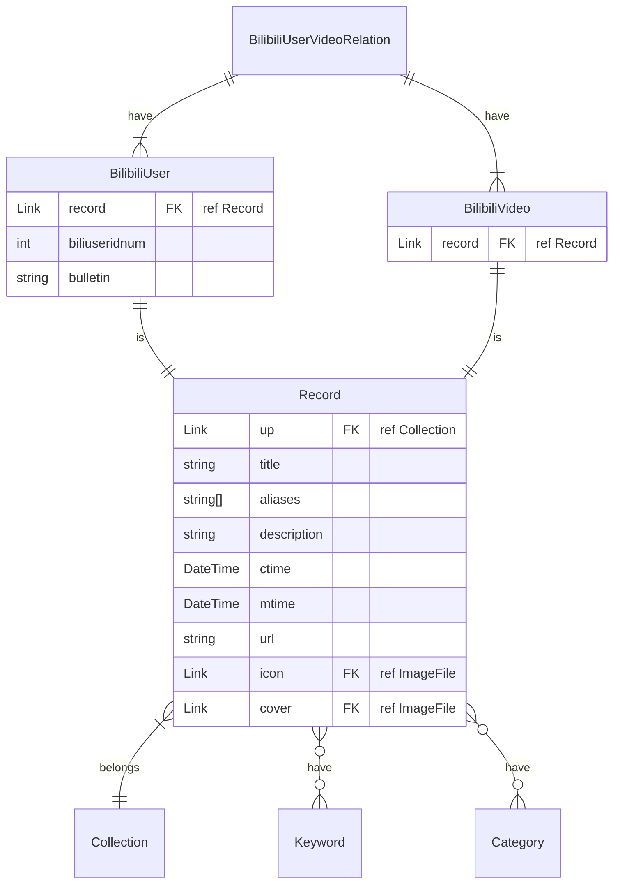

---
up:
  - "[[video-doc-collection|collection]]"
bases:
  - "[[base-bilibili-user.base|base-bilibili-user.base]]"
ctime: 2025-08-05T00:44:53+08:00
mtime: 2025-11-11T17:13:51+08:00
title: Bilibili User
aliases:
  - Bilibili User
tags:
  - bilibili
  - user
---

# Bilibili User

- base: [[base-bilibili-user.base|base-bilibili-user.base]]
- by-category
	- G898: [[bilibili-user-143432483\|瑛之诗]]
	- J2: [[bilibili-user-34106682|隅野贝]]
	- K: [[bilibili-user-269115278|历史影像馆]]、[[bilibili-user-98695167|茄子蒜泥儿]]
	- O1: [[bilibili-user-180947374|PiKaChu345]]、[[bilibili-user-88461692|3Blue1Brown]]
	- Q189: [[bilibili-user-339833006|杨雨坤-Yukun]]
	- R1: [[bilibili-user-297786973|胖鹈鹕]]、[[bilibili-user-413597883|铁打的郎中]]
	- TP: [[bilibili-user-162183|原子能]]
	- Z: [[bilibili-user-689888414|bili_62511222486]]

![[base-bilibili-user.base|base-bilibili-user.base]]

## Schema

[[bilibili-doc-schema]]
