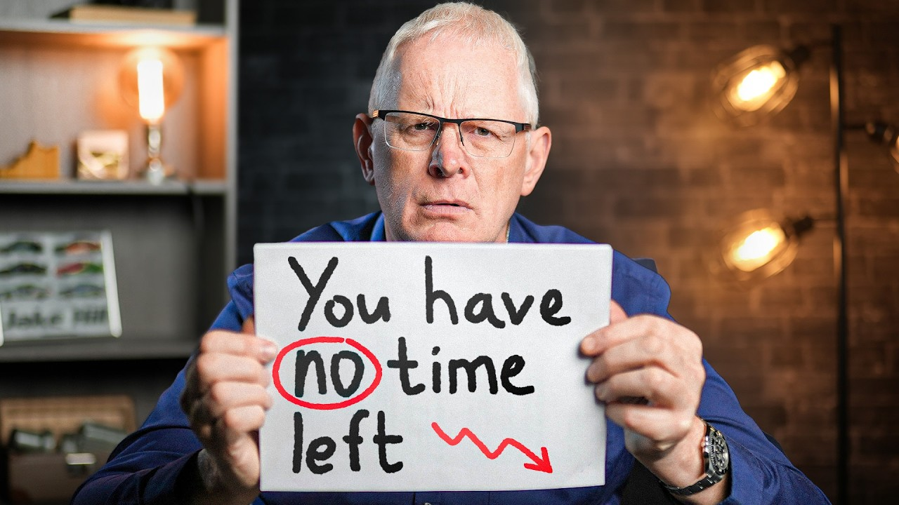

---
up:
  - "[[collection-youtube-video|collection-youtube-video]]"
title: I'm 57. If you're in your 20's please watch this.
url: https://www.youtube.com/watch?v=FylHa4_neOA
description: Get a FREE AI-built Shopify store in less than 2 minutes:https://www.buildyourstore.ai/mark-tilburyUse the promo code TILBURY to get a free share worth up to...
tags:
  - 经验分享
comment: "2,558,057 views  Sep 28, 2024 Get a FREE AI-built Shopify store in less than 2 minutes: https://www.buildyourstore.ai/mark-ti...  Use the promo code TILBURY to get a free share worth up to £100 or visit https://www.trading212.com/join/TILBURY (terms & conditions apply)  If I were to give advice to my 20 year old self, this is what I'd say to him.  Thanks ‪@danfounder‬ for inspiring this video!  ________________________________________________  TIME STAMPS: - 00:00 Intro - 00:09 1. Work on your willpower - 00:40 2. Producer VS Consumer - 00:54 3. Be nice to people on the come up - 01:19 4. Watch others & then do the opposite - 01:59 5. Who you know matters more than what you know - 02:10 6. Never talk behind someone's back - 02:28 7. Make more mistakes - 02:59 8. Make reversible decisions quickly - 03:22 9. Focus on one thing at a time - 03:36 10. Don’t be the best, be the only - 04:00 11. If you don’t like something then change it. - 04:31 12. Work smart not hard - 05:52 13: Assume you can learn something new from everyone - 06:22 14. Never disrespect your elders - 06:44 15. Don’t be scared of change, embrace it. - 07:18 16. Live in the moment, not on your phone - 07:46 17. Always pay the bill - 08:02 18. Say no if you aren’t ready - 08:20 19. Present yourself in the way you wish to be perceived - 08:41 20. Mentally prepare yourself for your loved ones dying - 09:04 21. Never take rejection personally - 09:18 22. Don’t be embarrassed to take a nap - 09:40 23. Learn from those who disagree with you - 09:56 24. Never be late - 10:10 25. Be motivated by something greater than money - 10:38 26. Be fuelled by vision not fear - 10:48 27. Stand up to bullies - 11:13 28. Use your unfair advantages - 11:39 29. Skip the flashy car - 12:00 30. Prioritise your reputation - 12:17 31. Don't compare yourself to your friends - 12:36 32. Don’t let a bad day turn into a bad week - 12:55 33. Always Pay off your credit card - 13:12 34. Any job is better than no job - 13:36 35. Never invest without doing your research - 13:56 36. Being a great storyteller can get you anything you want - 14:21 37. Don’t live your life for others - 14:42 38. Have a solid paycheck routine - 15:21 39. It's not the end of the world if you don't have everything figured out - 15:52 40. Start investing now - 16:14 41. The quality of your questions will shape your future success. - 16:56 42. Make sure to enjoy the journey, not just focus on the destination - 17:39 43. Nothing is ever free - 18:20 44. Stop waiting to be inspired - 18:44 45. Work hard now for an easier life later - 19:33 46. Tackle the tough tasks in the morning - 20:15 47. The name of a university means absolutely nothing - 20:35 48. Look after your back. - 21:14 49. Don’t stress about being different—you don’t have to fit in - 21:58 50. Choose your partner wisely.  ________________________________________________  GET IN TOUCH: - For business inquires only, please use this email: mark@marktilbury.com   Some of the links in this description are affiliate links that I get a commission from  "
cover: "[[youtube-video-FylHa4_neOA.jpg]]"
authors:
  - "[[youtube-channel-UCxgAuX3XZROujMmGphN_scA|Mark Tilbury]]"
aliases:
  - I'm 57. If you're in your 20's please watch this.
ctime: 2024-11-22T21:32:53+08:00
mtime: 2025-11-09T22:24:12+08:00
---

# I'm 57. If You're in Your 20's Please Watch This

- url: https://www.youtube.com/watch?v=FylHa4_neOA
- title: "I'm 57. If you're in your 20's please watch this."
- description: "Get a FREE AI-built Shopify store in less than 2 minutes:https://www.buildyourstore.ai/mark-tilburyUse the promo code TILBURY to get a free share worth up to..."
- host: www.youtube.com
- favicon: https://www.youtube.com/s/desktop/ceaca137/img/logos/favicon_32x32.png
- image: https://i.ytimg.com/vi/FylHa4_neOA/maxresdefault.jpg

[(95) I'm 57. If you're in your 20's please watch this. - YouTube](https://www.youtube.com/watch?v=FylHa4_neOA)

## comment

2,558,057 views  Sep 28, 2024
Get a FREE AI-built Shopify store in less than 2 minutes:
https://www.buildyourstore.ai/mark-ti...

Use the promo code TILBURY to get a free share worth up to £100 or visit https://www.trading212.com/join/TILBURY (terms & conditions apply)

If I were to give advice to my 20 year old self, this is what I'd say to him.

Thanks ‪@danfounder‬ for inspiring this video!

________________________________________________

TIME STAMPS:
- 00:00 Intro
- 00:09 1. Work on your willpower
- 00:40 2. Producer VS Consumer
- 00:54 3. Be nice to people on the come up
- 01:19 4. Watch others & then do the opposite
- 01:59 5. Who you know matters more than what you know
- 02:10 6. Never talk behind someone's back
- 02:28 7. Make more mistakes
- 02:59 8. Make reversible decisions quickly
- 03:22 9. Focus on one thing at a time
- 03:36 10. Don’t be the best, be the only
- 04:00 11. If you don’t like something then change it.
- 04:31 12. Work smart not hard
- 05:52 13: Assume you can learn something new from everyone
- 06:22 14. Never disrespect your elders
- 06:44 15. Don’t be scared of change, embrace it.
- 07:18 16. Live in the moment, not on your phone
- 07:46 17. Always pay the bill
- 08:02 18. Say no if you aren’t ready
- 08:20 19. Present yourself in the way you wish to be perceived
- 08:41 20. Mentally prepare yourself for your loved ones dying
- 09:04 21. Never take rejection personally
- 09:18 22. Don’t be embarrassed to take a nap
- 09:40 23. Learn from those who disagree with you
- 09:56 24. Never be late
- 10:10 25. Be motivated by something greater than money
- 10:38 26. Be fuelled by vision not fear
- 10:48 27. Stand up to bullies
- 11:13 28. Use your unfair advantages
- 11:39 29. Skip the flashy car
- 12:00 30. Prioritise your reputation
- 12:17 31. Don't compare yourself to your friends
- 12:36 32. Don’t let a bad day turn into a bad week
- 12:55 33. Always Pay off your credit card
- 13:12 34. Any job is better than no job
- 13:36 35. Never invest without doing your research
- 13:56 36. Being a great storyteller can get you anything you want
- 14:21 37. Don’t live your life for others
- 14:42 38. Have a solid paycheck routine
- 15:21 39. It's not the end of the world if you don't have everything figured out
- 15:52 40. Start investing now
- 16:14 41. The quality of your questions will shape your future success.
- 16:56 42. Make sure to enjoy the journey, not just focus on the destination
- 17:39 43. Nothing is ever free
- 18:20 44. Stop waiting to be inspired
- 18:44 45. Work hard now for an easier life later
- 19:33 46. Tackle the tough tasks in the morning
- 20:15 47. The name of a university means absolutely nothing
- 20:35 48. Look after your back.
- 21:14 49. Don’t stress about being different—you don’t have to fit in
- 21:58 50. Choose your partner wisely.

________________________________________________

GET IN TOUCH:
- For business inquires only, please use this email: mark@marktilbury.com

 Some of the links in this description are affiliate links that I get a commission from
